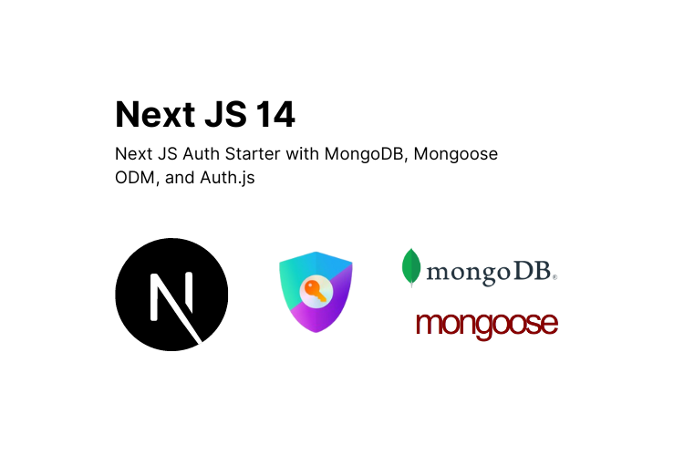

# Next JS 14 Auth Starter 
A Next JS 14 auth starter for Next JS devs with MongoDB, Mongoose ODM, and Auth.js



# Environment Variables

```
MONGODB_URI
AUTH_SECRET
AUTH_URL
AUTH_GOOGLE_ID
AUTH_GOOGLE_SECRET
```

# Install Packages

### Auth JS
```
npm install next-auth@beta
```

### Mongoose
```
npm install mongoose
```
### MongoDB Client

```
npm install mongodb
```

# Auth Configurations

### auth.config.ts
```typescript

import type { NextAuthConfig } from "next-auth";

export const authConfig = {
  pages: {
    signIn: "/login",
    signOut: "/login"
  },
  callbacks: {
    authorized({ auth, request: { nextUrl } }){
      const isLoggedIn = !!auth?.user;
      const isOnHome = nextUrl.pathname.startsWith("/welcome");
      if (isOnHome) {
        if (isLoggedIn){ 
          return true
        };
        return false; // Redirect unauthenticated users to login page
      } else if (isLoggedIn) {
        return Response.redirect(new URL("/welcome", nextUrl));
      }
      return true;
    },
  },
  providers: [],
} satisfies NextAuthConfig;

```
### middleware.ts

```typescript
import NextAuth from "next-auth";
import { authConfig } from "./auth.config";

export default NextAuth(authConfig).auth;

export const config = {
  // https://nextjs.org/docs/app/building-your-application/routing/middleware#matcher
  matcher: ["/((?!api|_next/static|_next/image|.*\\.png$).*)"],
};
```

### auth.ts

```typescript
import NextAuth from "next-auth";
import { authConfig } from "./auth.config";
import Credentials from "next-auth/providers/credentials";
import { z } from "zod";
import bcrypt from "bcrypt";
import User from "./app/lib/models/User";
import dbConnect from "./app/lib/db-connect";

interface UserObject {
  email: string;
  firstName: string;
  lastName: string;
  image: string;
  hash: string;
  salt: string;
  createdAt: string;
}

async function getUser(email: string): Promise<UserObject | undefined> {
  try {
    await dbConnect();
    const user = await User.findOne({ email: email });
    return user;
  } catch (error) {
    console.log(error);
    throw new Error("Failed to fetch user");
  }
}

export const { auth, signIn, signOut } = NextAuth({
  ...authConfig,
  providers: [
    Credentials({
      async authorize(credentials) {
        const parsedCredentials = z
          .object({ email: z.string().email(), password: z.string().min(6) })
          .safeParse(credentials);

        if (parsedCredentials.success) {
          const { email, password } = parsedCredentials.data;
          const user = await getUser(email);
          if (!user) return null;
          const passwordsMatch = await bcrypt.compare(password, user.hash);

          if (passwordsMatch) return user;
        }

        console.log("Invalid credentials");
        return null;
      },
    }),
  ],
});
```
### auth-with-provider.ts

```typescript
import { MongoDBAdapter } from "@auth/mongodb-adapter";
import clientPromise from "./app/lib/mongodb-client";
import Google from "next-auth/providers/google";
import NextAuth from "next-auth";
import Facebook from "next-auth/providers/facebook"

export const { handlers, auth, signIn, signOut } = NextAuth({
  pages: {
    signIn: "/login",
    signOut: "/login",
  },
  session: { strategy: "jwt"},
  debug: true,
  adapter: MongoDBAdapter(clientPromise),
  providers: [Google, Facebook],
  callbacks: {
    session({ session, user }) {
      session.user.id = user.id;
      return session;
    },
  },
});
```

# Database Configurations

### mongodb-client.ts
This is for the MongoDBAdapter used in auth-with-provider.ts  

MongoDBAdapter is the database adapter used for database session. But in this codebase, I didn’t used the database session. Rather I’ve just used it to store the users in the database even though they signed in using a provider. I’m using jwt as a session strategy. I’ve forced jwt so sessions are just in the browser and not stored in the database. But depending in your use case, you can store sessions in the database. 

```typescript
// This approach is taken from https://github.com/vercel/next.js/tree/canary/examples/with-mongodb
import { MongoClient, ServerApiVersion } from "mongodb"
 
if (!process.env.MONGODB_URI) {
  throw new Error('Invalid/Missing environment variable: "MONGODB_URI"')
}
 
const uri = process.env.MONGODB_URI
const options = {
  serverApi: {
    version: ServerApiVersion.v1,
    strict: true,
    deprecationErrors: true,
  },
}
 
let client
let clientPromise: Promise<MongoClient>
 
if (process.env.NODE_ENV === "development") {
  // In development mode, use a global variable so that the value
  // is preserved across module reloads caused by HMR (Hot Module Replacement).
  let globalWithMongo = global as typeof globalThis & {
    _mongoClientPromise?: Promise<MongoClient>
  }
 
  if (!globalWithMongo._mongoClientPromise) {
    client = new MongoClient(uri, options)
    globalWithMongo._mongoClientPromise = client.connect()
  }
  clientPromise = globalWithMongo._mongoClientPromise
} else {
  // In production mode, it's best to not use a global variable.
  client = new MongoClient(uri, options)
  clientPromise = client.connect()
}
// Export a module-scoped MongoClient promise. By doing this in a
// separate module, the client can be shared across functions.
export default clientPromise
```
source: [Auth JS - MongoDB Adapter](https://authjs.dev/getting-started/adapters/mongodb#add-the-mongodb-client)

### db-connect.ts
```typescript
import mongoose from "mongoose";
declare global {
  var mongoose: any; // This must be a `var` and not a `let / const`
}

const MONGODB_URI = process.env.MONGODB_URI!;

if (!MONGODB_URI) {
  throw new Error(
    "Please define the MONGODB_URI environment variable inside .env.local",
  );
}

let cached = global.mongoose;

if (!cached) {
  cached = global.mongoose = { conn: null, promise: null };
}

async function dbConnect() {
  if (cached.conn) {
    return cached.conn;
  }
  if (!cached.promise) {
    const opts = {
      bufferCommands: false,
    };
    cached.promise = mongoose.connect(MONGODB_URI, opts).then((mongoose) => {
      return mongoose;
    });
  }
  try {
    cached.conn = await cached.promise;
  } catch (e) {
    cached.promise = null;
    throw e;
  }

  return cached.conn;
}

export default dbConnect;
```
source: [with-mongodb-mongoose](https://github.com/vercel/next.js/blob/canary/examples/with-mongodb-mongoose/lib/dbConnect.ts)


Thank you!  
Made with ❤️ by erxon


